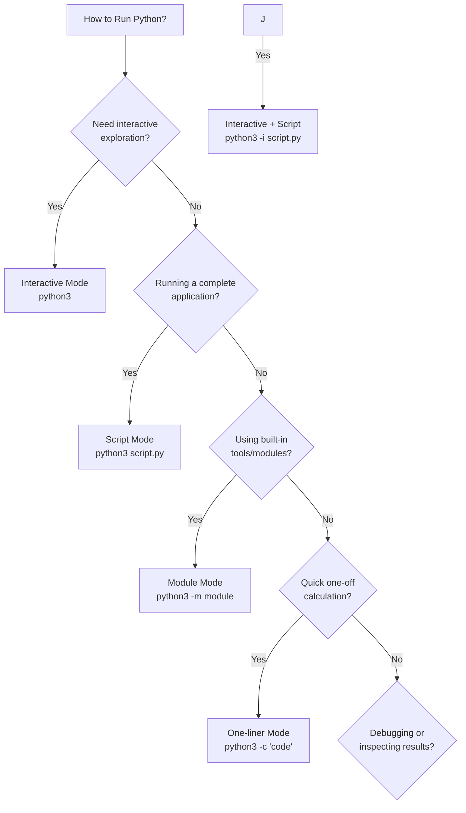

# 🐍 Running Python Code

Python offers multiple execution modes tailored for different scenarios, whether you're testing quick snippets, debugging, or running production applications. This guide covers the most common methods with practical examples.

## Platform-Specific Commands

| Platform | Primary Command | Alternative |
|----------|-----------------|-------------|
| **Windows** | `python` or `py` | - |
| **macOS/Linux** | `python3` | `python` (may point to Python 2) |

**Always verify your Python version:**
```bash
# Windows
python --version
py --version

# macOS/Linux
python3 --version
```

> 💡 **Why `python3` on macOS/Linux?** These systems often include Python 2 by default. Using `python3` ensures you're running the correct version.

---

## Execution Modes Overview

| Mode | Command (Linux/macOS) | Command (Windows) | Use Case |
|------|----------------------|------------------|----------|
| **Interactive (REPL)** | `python3` | `py` / `python` | Quick testing & learning |
| **Run Script** | `python3 script.py` | `py script.py` | Full applications |
| **One-liner** | `python3 -c "code"` | `py -c "code"` | Quick commands |
| **Run Module** | `python3 -m module` | `py -m module` | Built-in tools & packages |
| **Script + Interactive** | `python3 -i script.py` | `py -i script.py` | Debugging & analysis |

---

## Detailed Mode Explanations

### 1. Interactive Mode (REPL)
**Perfect for:** Testing code snippets, learning Python, quick calculations

```bash
# Start interactive session
$ python3
Python 3.11.0 (default, Oct 24 2023, 18:15:00)
Type "help", "copyright", "credits" or "license" for more information.
>>> print("Hello, World!")
Hello, World!
>>> 5 + 3
8
>>> exit()  # Or press Ctrl+D to exit
```

**Key Features:**
- Immediate code execution and feedback
- Access to help with `help(function_name)`
- Command history (use up/down arrows)

### 2. Run Script Mode
**Perfect for:** Running complete programs, production code, applications

**Example script (`hello.py`):**
```python
# hello.py
def greet(name):
    return f"Hello, {name}!"

if __name__ == "__main__":
    print(greet("Alice"))
    print("Script execution complete!")
```

**Execution:**
```bash
$ python3 hello.py
Hello, Alice!
Script execution complete!
$
```

### 3. One-liner Mode (`-c` flag)
**Perfect for:** Quick calculations, system tasks, shell scripting

```bash
# Simple calculation
$ python3 -c "print(5 * 7)"
35

# Multiple commands (use semicolons)
$ python3 -c "import os; print(f'Current dir: {os.getcwd()}')"
Current dir: /home/user/projects

# Using environment variables
$ python3 -c "import os; print(os.environ.get('USER', 'Unknown'))"
alice
```

### 4. Run Module Mode (`-m` flag)
**Perfect for:** Built-in utilities, installed packages, module execution

```bash
# Start a local web server
$ python3 -m http.server
Serving HTTP on 0.0.0.0 port 8000 (http://0.0.0.0:8000/) ...

# Format JSON files
$ python3 -m json.tool data.json

# Run pip as module (recommended)
$ python3 -m pip install requests

# Create virtual environment
$ python3 -m venv myenv
```

### 5. Script + Interactive Mode (`-i` flag)
**Perfect for:** Debugging, data analysis, exploring script results

**Example script (`calculator.py`):**
```python
# calculator.py
def multiply(a, b):
    return a * b

def add(a, b):
    return a + b

result = multiply(6, 7)
print(f"Calculation result: {result}")
```

**Interactive debugging session:**
```bash
$ python3 -i calculator.py
Calculation result: 42
>>> result          # Access variables from script
42
>>> multiply(3, 4)  # Call functions from script
12
>>> add(10, 5)
15
>>> dir()           # See available objects
['__builtins__', '__doc__', 'add', 'multiply', 'result']
```


---

## Quick Decision Guide



---

## Further Reading

* [Python Module Search Path](https://docs.python.org/3/tutorial/modules.html)

---

**Ready to run some code?** Choose the execution mode that matches your current task and start coding! 🚀
