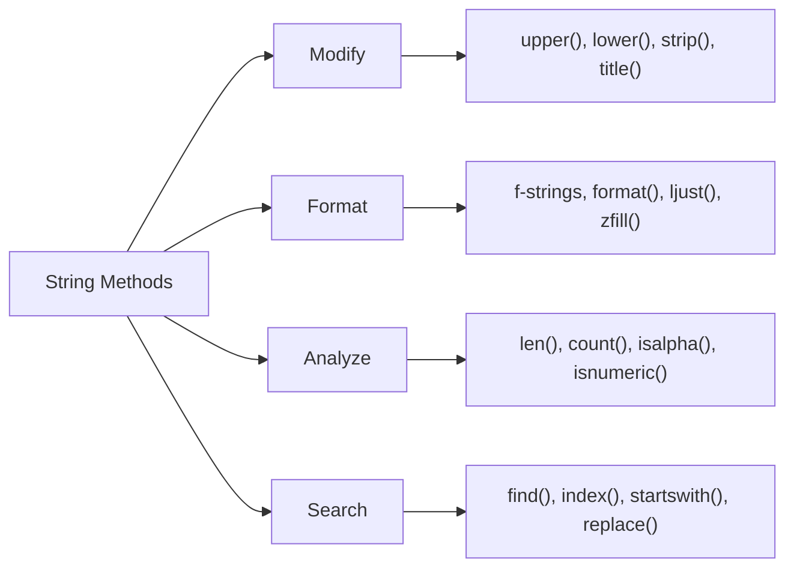

# 🧮 Working with String Functions in Python

Strings are more than just words — they come with **powerful built-in functions** that help you **analyze, clean, and transform** text easily.

Let’s start with some basic examples.

```python
>>> text = "Python"
````

---

## 1️⃣ `len()` — Count Characters

The `len()` function counts how many characters (letters, spaces, or punctuation) are in a string.

```python
>>> len(text)
6
```

🧠 **Why it matters:**
You can use it to validate username lengths, check password size, or count characters in text.

---

## 2️⃣ `upper()` — Convert to Uppercase

Converts all letters in a string to **uppercase**.

```python
>>> text.upper()
'PYTHON'
```

✅ **Use case:**
Normalize text for comparison.

```python
"python".upper() == "PYTHON"  # True
```

---

## 3️⃣ `lower()` — Convert to Lowercase

Changes all letters to **lowercase**.

```python
>>> text.lower()
'python'
```

✅ Helps you compare text safely without worrying about letter case.

---

## 4️⃣ `title()` — Capitalize Each Word

Turns the first letter of each word into uppercase.

```python
>>> text.title()
'Python'
```

💡 **Example:**
`"hello world".title()` → `"Hello World"`

---

## 5️⃣ `replace()` — Replace Parts of Text

Replaces one substring with another.

```python
>>> text.replace("Py", "My")
'Mython'
```

🧠 **Why it’s useful:**
Clean up data easily.
Example: `"2025-10-14".replace("-", "/")` → `'2025/10/14'`

---

## 6️⃣ `startswith()` — Check Beginning

Checks whether a string starts with a specific substring.

```python
>>> text.startswith("Py")
True
```

---

## 7️⃣ `endswith()` — Check Ending

Checks whether a string ends with a specific substring.

```python
>>> text.endswith("on")
True
```

💡 **Example:**
`"report.pdf".endswith(".pdf")` → `True`
Useful when checking **file extensions** or **URL patterns**.

---

## 🧩 Combining and Repeating Strings

You can **join** or **repeat** strings using simple operators.

---

### ➕ Concatenation (`+`)

Combine strings together with `+`.

```python
>>> a = "Py"
>>> b = "thon"
>>> a + b
'Python'
```

💡 `"Hello, " + "world!"` → `"Hello, world!"`

---

### ✳️ Repetition (`*`)

Repeat strings multiple times using `*`.

```python
>>> "Hi! " * 3
'Hi! Hi! Hi! '
```

🎯 **Example use:**
Create visual dividers.

```python
>>> print("=" * 20)
====================
```

---

## 🔍 Check for Substrings

Use `in` or `not in` to check if one string exists inside another.

```python
>>> "th" in "Python"
True

>>> "java" not in "Python"
True
```

🧠 `"th"` exists inside `"Python"`, but `"java"` doesn’t — so the second line returns `True`.

---

## 🧠 Summary of Basic String Operations

| Operation        | Method / Symbol | Example                     | Output           |
| ---------------- | --------------- | --------------------------- | ---------------- |
| Count characters | `len()`         | `len("Python")`             | `6`              |
| Uppercase        | `.upper()`      | `"Python".upper()`          | `'PYTHON'`       |
| Lowercase        | `.lower()`      | `"Python".lower()`          | `'python'`       |
| Title case       | `.title()`      | `"hello world".title()`     | `'Hello World'`  |
| Replace text     | `.replace()`    | `"Py".replace("P","M")`     | `'My'`           |
| Check prefix     | `.startswith()` | `"Python".startswith("Py")` | `True`           |
| Check suffix     | `.endswith()`   | `"Python".endswith("on")`   | `True`           |
| Combine          | `+`             | `"Py" + "thon"`             | `'Python'`       |
| Repeat           | `*`             | `"Hi! " * 3`                | `'Hi! Hi! Hi! '` |
| Search           | `in`, `not in`  | `"th" in "Python"`          | `True`           |

---

---

# 🧰 Useful String Methods

Strings also include many **built-in methods** for cleaning and manipulating text.

| Method    | Description                            | Example                       | Output                     |
| --------- | -------------------------------------- | ----------------------------- | -------------------------- |
| `strip()` | Removes spaces from the start and end. | `"  hello  ".strip()`         | `'hello'`                  |
| `split()` | Breaks text into a list.               | `"red,green,blue".split(",")` | `['red', 'green', 'blue']` |
| `join()`  | Combines list items into text.         | `"-".join(['A','B','C'])`     | `'A-B-C'`                  |
| `find()`  | Returns index of first match.          | `"hello".find('o')`           | `4`                        |
| `count()` | Counts how often something appears.    | `"banana".count('a')`         | `3`                        |

---

## 1️⃣ `strip()` — Remove Whitespace

```python
>>> message = "   Welcome to Python!   "
>>> message.strip()
'Welcome to Python!'
```

💡 Use `.lstrip()` or `.rstrip()` to remove from one side only.

---

## 2️⃣ `split()` — Break Text Apart

```python
>>> colors = "red,green,blue"
>>> colors.split(",")
['red', 'green', 'blue']
```

📘 Perfect for breaking apart user input or CSV data.

---

## 3️⃣ `join()` — Combine Lists into Text

```python
>>> words = ['Python', 'is', 'fun']
>>> " ".join(words)
'Python is fun'
```

💡 Example: `"-".join(['2025','10','29'])` → `'2025-10-29'`

---

## 4️⃣ `find()` — Locate a Substring

```python
>>> phrase = "hello world"
>>> phrase.find("o")
4
```

If not found, it returns `-1`.

---

## 5️⃣ `count()` — Count Occurrences

```python
>>> fruit = "banana"
>>> fruit.count("a")
3
```

🎯 Great for analyzing or validating text patterns.

---

# 💬 String Formatting

You can **insert variables** into text dynamically.

---

### 1️⃣ f-Strings (Modern & Recommended)

```python
>>> name = "Binahf"
>>> lang = "Python"
>>> f"Hello {name}, welcome to {lang}!"
'Hello Binahf, welcome to Python!'
```

---

### 2️⃣ `.format()` Method (Older Style)

```python
>>> "Hello {}, you’re using {}!".format("Binahf", "Python")
'Hello Binahf, you’re using Python!'
```

---

### 3️⃣ `%` Formatting (Legacy)

```python
>>> "Pi is approximately %.2f" % 3.14159
'Pi is approximately 3.14'
```

---

# 🧠 Escaping and Raw Strings

Use escape sequences for special characters, or prefix with `r` for **raw strings**.

```python
>>> print("Line1\nLine2")
Line1
Line2

>>> print(r"Line1\nLine2")
Line1\nLine2
```

| Sequence | Meaning      |
| -------- | ------------ |
| `\n`     | New line     |
| `\t`     | Tab          |
| `\\`     | Backslash    |
| `\"`     | Double quote |
| `\'`     | Single quote |

---

# 🌍 Unicode and Encoding

Python strings are **Unicode** by default.

```python
>>> s = "Hello"
>>> b = s.encode('utf-8')
>>> b
b'Hello'
>>> b.decode('utf-8')
'Hello'
```

---

# 💎 Advanced Formatting

### 🔢 Numbers

```python
pi = 3.14159265
print(f"Pi rounded: {pi:.2f}")       # 3.14
print(f"With padding: {pi:10.3f}")   #      3.142
print(f"As percentage: {0.25:.0%}")  # 25%
```

### 💰 Currency

```python
amount = 1234.5
print(f"Amount: ${amount:,.2f}")  # Amount: $1,234.50
```

### 🕒 Dates

```python
from datetime import datetime
now = datetime.now()
print(f"Today: {now:%Y-%m-%d}")
print(f"Time: {now:%H:%M:%S}")
print(f"Full: {now:%A, %B %d, %Y}")
```

---

# 🧪 Practice Challenges

### 🧩 Challenge 1

Write a program that:

* Asks for your first and last name.
* Prints: `"Hello, FIRST LAST!"` in uppercase.

<details>
<summary>Show Solution</summary>

```python
first = input("Enter first name: ")
last = input("Enter last name: ")
print(f"Hello, {first.upper()} {last.upper()}!")
```

</details>

---

### 🧩 Challenge 2

Format a floating-point number to **two decimal places**.

<details>
<summary>Show Solution</summary>

```python
num = 3.14159
print(f"{num:.2f}")
```

</details>

---

### 🧩 Challenge 3

Display today’s date as:
`Today is Friday, October 10, 2025`

<details>
<summary>Show Solution</summary>

```python
from datetime import datetime
print(f"Today is {datetime.now():%A, %B %d, %Y}")
```

</details>

---

### 🧩 Challenge 4

Create a sentence template with f-strings for `name`, `age`, and `city`.

<details>
<summary>Show Solution</summary>

```python
name, age, city = "Binahf", 25, "Accra"
print(f"My name is {name}, I’m {age}, and I live in {city}.")
```

</details>

---

# 🧭 String Method Map



---

### 🧩 How to Read This

* **Modify:** Change how text looks.
* **Format:** Align and pad text or numbers.
* **Analyze:** Inspect string contents.
* **Search:** Locate or replace patterns.

Try chaining them in REPL:

```python
>>> text = "  Python  "
>>> text.strip().upper()
'PYTHON'
```

---

## 💡 Best Practices

✅ Prefer **f-strings** — they’re clean, fast, and safe.
✅ Always **strip whitespace** before comparing text.
✅ Avoid inserting untrusted user input directly into formatted strings.

---

<div align="center">

### ✨ Strings are everywhere in Python

Understanding how to clean, combine, and format them makes your programs powerful, clear, and reliable.

</div>
