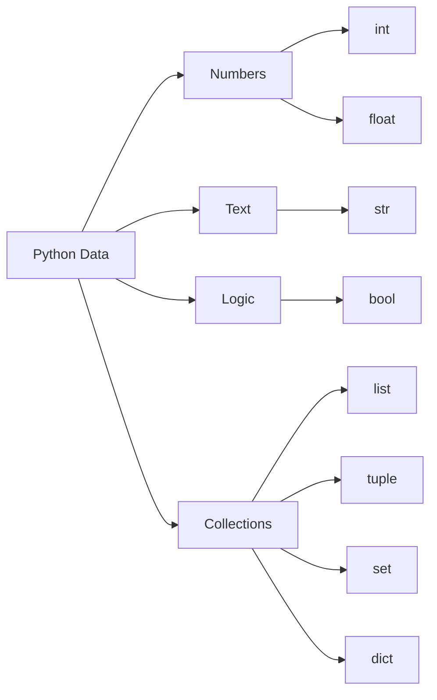

# 🧩 Python Data Types

Every value in Python has a **data type** a classification that tells Python:

* What kind of information the value represents
* How it should be stored in memory
* Which operations are allowed on it

For example, Python understands `5 + 3` because both values are numbers:

```python
5 + 3 # Result 8
```

But mixing incompatible types causes an error:

```python
"Hello" + 5 # TypeError: can only concatenate str (not "int") to str
```

Python cannot directly combine **text** and **numbers** without explicit conversion.

---

## 🧠 The Big Idea

Think of data types as **different kinds of containers**. Each container behaves differently depending on what it holds, just like a glass jar is great for liquids but a cardboard box is better for solid objects.



---

## 🧑‍💻 Launch the REPL

Python comes with an **interactive shell**, the **REPL** (Read–Eval–Print–Loop).
It’s a fast, hands‑on way to experiment, explore syntax, and test ideas.

## Setup python

1. Install **Python 3** from [python.org](https://www.python.org/downloads/)
1. Choose a code editor: **VS Code**, **PyCharm**, or **Neovim**
1. Verify your installations:

```bash
python --version # python3 on macOS
pip --version
```

Start the REPL:

```python
python # or py  on Windows
python3  # on macOS
```

Example session:

```python
>>> print("Hello, Python!")
Hello, Python!
>>> 10 * 3
30>>> exit()   # or press Ctrl+D (Linux/Mac) / Ctrl+Z (Windows)
```

---

## 💡 Why Use the REPL

* ✅ Test code snippets interactively
* ✅ Explore built‑in functions (`help()`, `dir()`)
* ✅ Understand syntax and error messages on the fly
* ✅ Learn Python dynamically with zero setup

---

## 🧑‍💻 Two Ways to Run Python

## 1. Interactive Mode (REPL)

Start Python and type commands directly:

```python
python # or python3 on macOS
```

Quick experiment:

```python
type(42) # <class 'int'>
```

Perfect for **learning through immediate feedback**.
[Read more about the Python interpreter](https://docs.python.org/3/tutorial/interpreter.html)

---

## 2. Script Mode

Create a file, e.g. `data_types.py`:

```python
print(type(42)) # <class 'int'>
```

Run it from your terminal:

```bash
python data_types.py
```

This is how **real programs** are executed. You can also combine both modes:
`python -i data_types.py` runs the script and then drops you into the REPL.

---

## 🔎 Inspecting Data Types

Use the built‑in function `type()` to discover the type of any value:

```python
type(42)               # <class 'int'>
```

```python
type("hello")          # <class 'str'>
```

```python
type([1, 2, 3])        # <class 'list'>
```

---

## 🔢 Numbers

Numbers represent **quantities**.

## Integer (`int`) Whole Numbers

```python
age = 25
type(age)
```

Python integers can be arbitrarily large:

```python
2 ** 100      # 1267650600228229401496703205376
```

Math examples:

```python
10 + 5        # 15
7 - 3         # 4
4 * 6         # 24
2 ** 3        # 8 (exponentiation)
```

## Float (`float`) Decimal Numbers

```python
price = 19.99
type(price) # <class 'float'>
```

```python
7.5 + 2.5     # 10.0
```

Be aware that floats have limited precision due to how computers store decimals:

```python
0.1 + 0.2     # 0.30000000000000004 (not exactly 0.3)
```

---

## Mixing Strings & Numbers

```python
"Age: " + 25  # ❌ TypeError: can only concatenate str (not "int") to str
```

**Correct approach:** convert the number to a string first.

```python
"Age: " + str(25)      # ✅ "Age: 25"
```

Or use an **f‑string** (Python 3.6+):

```python
f"Age: {25}"           # ✅ "Age: 25"
```

---

## 📝 Strings

Strings store **text** sequences of characters enclosed in quotes.

```python
name = "Python"
name.upper()           # "PYTHON"
```

```python
len("python")          # 6 (length of the string)
```

Strings can be repeated with the `*` operator:

```python
"ha" * 3               # "hahaha"
```

## Mismatched Quotes

**Valid:**

```python
"Hello" # double quote

'Hello' # single quote

"""Multi‑line
string""" # multip string
```

**Invalid (opens with double quote but closes with single):**

```python
"Hello'   # ❌ SyntaxError
```

---

## ✅ Booleans

Booleans represent **logical values**: either `True` or `False`.

```python
10 > 5       # True
10 == 3      # False
```

```python
is_adult = 18 >= 18
is_adult     # True
```

Booleans are the foundation of **decision making** in programs (e.g., `if` statements).

---

## 🧺 Lists

Lists store **ordered collections** of items. They can contain mixed types and are **mutable** (you can change them).

```python
fruits = ["apple", "banana", "cherry"]
fruits
```

Add an item with `.append()`:

```python
fruits.append("orange")
fruits
```

Access items by index (starting at 0):

```python
fruits[0]      # "apple"
fruits[-1]     # "orange" (negative indices count from the end)
```

## Index Errors

```python
fruits[10]     # ❌ IndexError: list index out of range
```

---

## 🔒 Tuples

Tuples are **immutable** once created, their contents cannot be changed.

```python
coords = (10, 20)
coords[0]      # 10
```

Attempting to modify a tuple raises an error:

```python
coords[0] = 50  # ❌ TypeError: 'tuple' object does not support item assignment
```

Use tuples when you want to guarantee that a collection of values stays constant (e.g., coordinates, RGB color values).

---

## 🎯 Sets

Sets store **unique, unordered** items. Duplicates are automatically removed.

```python
numbers = {1, 2, 2, 3}
numbers        # {1, 2, 3}
```

Add new items with `.add()`:

```python
numbers.add(4)
numbers        # {1, 2, 3, 4}
```

Sets are great for membership tests and eliminating duplicates.

---

## 🗂️ Dictionaries

Dictionaries store **key‑value pairs**. Keys must be immutable (strings, numbers, tuples) and are used to look up values.

```python
person = {"name": "Alex", "age": 25}
person
```

Access a value by its key:

```python
person["name"]     # "Alex"
```

Add a new key‑value pair:

```python
person["city"] = "Accra"
person
```

Dictionaries are the backbone of many Python programs, especially when working with structured data (e.g., JSON).

---

## 🔄 Type Conversion

Sometimes you need to convert a value from one type to another. Python provides built‑in functions for this:

```python
int("10")          # 10 (string → integer)
float("3.14")      # 3.14 (string → float)
str(42)            # "42" (integer → string)
```

```python
list("abc")        # ['a', 'b', 'c']
tuple([1, 2, 3])   # (1, 2, 3)
set([1, 2, 2, 3])  # {1, 2, 3}
```

| Function  | Converts To | Notes                                   |
|-----------|-------------|-----------------------------------------|
| `int()`   | integer     | Truncates decimal part (e.g., `int(3.9)` → `3`) |
| `float()` | float       |                                         |
| `str()`   | string      |                                         |
| `list()`  | list        |                                         |
| `tuple()` | tuple       |                                         |
| `set()`   | set         | Removes duplicates, loses order         |

[Full list of Python built‑in functions](https://docs.python.org/3/library/functions.html)

---

## 🎯 Key Takeaways

* Every value in Python has a **type**.
* Types define **how data behaves** what operations are allowed and how the value is stored.
* Core built‑in types:

  | Category   | Types                          |
  |------------|--------------------------------|
  | Numbers    | `int`, `float`                 |
  | Text       | `str`                          |
  | Logic      | `bool`                         |
  | Collections| `list`, `tuple`, `set`, `dict` |

* Use `type()` to inspect any value.
* Convert between types explicitly when needed.
* Practice in the **REPL** it’s the fastest way to build muscle memory.

Mastering these fundamental types gives you a solid foundation for writing clear, efficient Python code. Happy coding!
