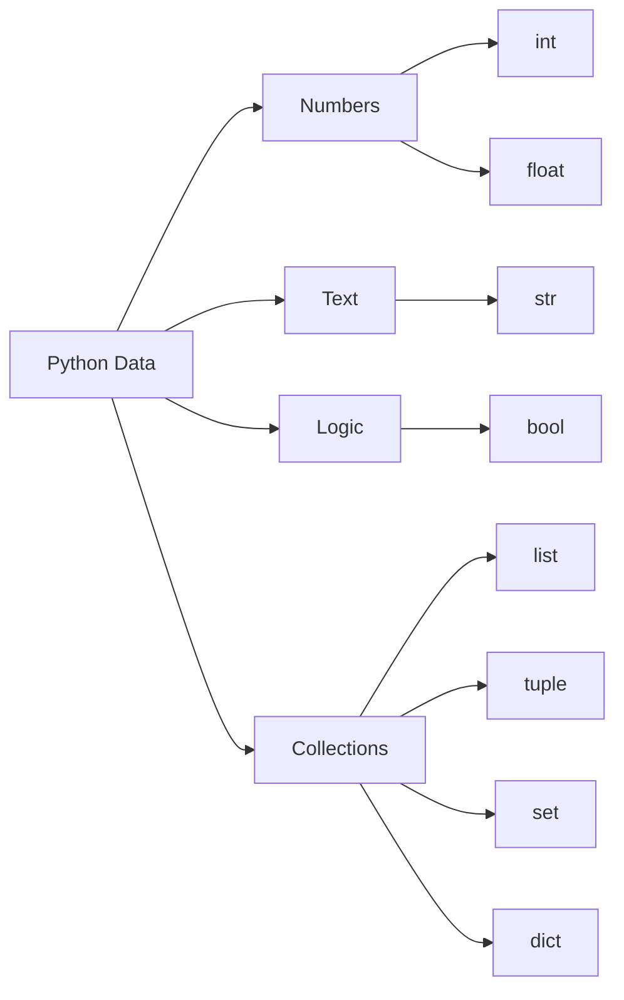

import InteractivePython from '@site/src/components/InteractivePython';

# 🧩 Understanding Python Data Types

Every value in Python has a **data type**.

A data type tells Python:

- what the value represents
- how it should be stored
- what operations are allowed

## Example

Try running this:

<InteractivePython
initialCode={`5 + 3`}
/>

Python understands this because both values are **numbers**.

But mixing incompatible types causes an error.

```python
"Hello" + 5
````

Python cannot directly combine **text** and **numbers**.

---

# 🧠 The Idea Behind Data Types

Think of Python data types as **containers for information**.



Each container behaves differently.

---

# 🔎 Inspecting Data Types

Python provides the built-in function `type()`.

Try these examples.

<InteractivePython
initialCode={`print(type(42))
print(type("hello"))
print(type([1,2,3]))`}
/>

Documentation
[https://docs.python.org/3/library/functions.html#type](https://docs.python.org/3/library/functions.html#type)

---

# 🔢 Numbers

Numbers represent **quantities and measurements**.

## Integer (`int`)

Whole numbers.

<InteractivePython
initialCode={`age = 25
print(type(age))

print(10 + 5)
print(2 ** 3)`}
/>

---

## Float (`float`)

Decimal numbers.

<InteractivePython
initialCode={`price = 19.99
print(type(price))

print(7.5 + 2.5)`}
/>

---

## ⚠️ Beginner Mistake

:::danger Mixing strings and numbers

This fails:

```python
"Age: " + 25
```

Correct approach:

<InteractivePython
initialCode={`print("Age: " + str(25))`}
/>

:::

---

# 📝 Strings

Strings store **text**.

<InteractivePython
initialCode={`name = "Python"

print(name.upper())
print(len("python"))
print("ha" * 3)`}
/>

---

## ⚠️ Beginner Mistake

:::danger Confusing quotes

Valid strings:

```python
"Hello"
'Hello'
```

Invalid example:

```python
"Hello'
```

Quotes must match.

:::

---

# ✅ Booleans

Booleans represent **True or False logic**.

<InteractivePython
initialCode={`print(10 > 5)
print(10 == 3)

is_adult = 18 >= 18
print(is_adult)`}
/>

Booleans power **decision making**.

---

# 🧺 Lists

Lists store **ordered collections of items**.

<InteractivePython
initialCode={`fruits = ["apple", "banana", "cherry"]

print(fruits)

fruits.append("orange")
print(fruits)

print(fruits[0])`}
/>

---

# 🔒 Tuples

Tuples are **immutable collections**.

<InteractivePython
initialCode={`coords = (10, 20)

print(coords)
print(coords[0])`}
/>

Trying to modify them fails:

```python
coords[0] = 50
```

---

# 🎯 Sets

Sets store **unique values**.

<InteractivePython
initialCode={`numbers = {1,2,2,3}

print(numbers)

numbers.add(4)

print(numbers)`}
/>

Duplicates disappear automatically.

---

# 🗂️ Dictionaries

Dictionaries store **key-value pairs**.

<InteractivePython
initialCode={`person = {
"name": "Alex",
"age": 25
}

print(person)

print(person["name"])

person["city"] = "Accra"

print(person)`}
/>

---

# 🔄 Type Conversion

Sometimes types must be converted.

Try these examples.

<InteractivePython
initialCode={`print(int("10"))
print(float("3.14"))
print(str(42))`}
/>

Common conversions:

| Function  | Converts To |
| --------- | ----------- |
| `int()`   | integer     |
| `float()` | decimal     |
| `str()`   | text        |
| `list()`  | list        |
| `tuple()` | tuple       |
| `set()`   | set         |

Reference
[https://docs.python.org/3/library/functions.html](https://docs.python.org/3/library/functions.html)

---

# 🧠 Interactive Knowledge Check

## Quiz 1

What type is `[1,2,3]`?

Run the code to check.

<InteractivePython
initialCode={`value = [1,2,3]
print(type(value))`}
/>

Expected answer: `list`.

---

## Quiz 2

What type is `{"name": "Alex"}`?

<InteractivePython
initialCode={`value = {"name": "Alex"}
print(type(value))`}
/>

Expected answer: `dict`.

---

## Quiz 3

What happens here?

<InteractivePython
initialCode={`print("ha" * 3)`}
/>

Expected result:

```
hahaha
```

---

# 🧪 Practice Challenges

## Challenge 1

Create these variables:

- name
- age
- height
- is_student

<InteractivePython
initialCode={`# Create variables here

name = ""
age = 0
height = 0.0
is_student = False

print(name, age, height, is_student)`}
/>

---

## Challenge 2

Create a **shopping list** using a list.

Add one item and remove one.

<InteractivePython
initialCode={`shopping_list = ["bread", "milk", "eggs"]

# add an item

shopping_list.append("butter")

# remove an item

shopping_list.remove("milk")

print(shopping_list)`}
/>

---

## Challenge 3

Create a **friend profile dictionary**.

Include:

- name
- age
- hobby
- city

<InteractivePython
initialCode={`friend = {
"name": "Alex",
"age": 25,
"hobby": "music",
"city": "Accra"
}

print(friend)`}
/>

---

# 🚀 Data Type Mission

Experiment with Python.

Try modifying the code below.

<InteractivePython
initialCode={`# Try experimenting

print(type("hello"))

numbers = [1,2,3]
print(len(numbers))

print("Python" * 2)

print(5 in [1,2,3,5])`}
/>

---

# 🎯 Key Takeaways

- Every Python value has a **data type**
- Data types define **how data behaves**
- Python core types include:

  - numbers
  - strings
  - booleans
  - lists
  - tuples
  - sets
  - dictionaries

Understanding these types gives you the **foundation of Python programming**.

```

---

# Result in Your Site

Readers will see **interactive code editors everywhere**.

Example block:

```

## Python Editor

name = "Python"
print(name.upper())
-------------------

[ Run Python ]
